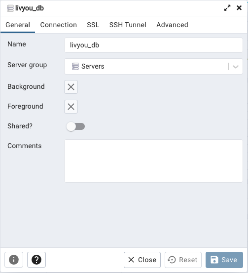
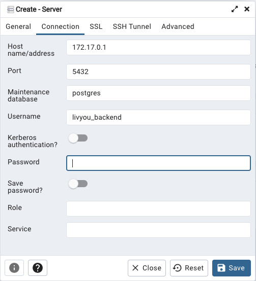

# liv_backend

Backend utilisé par l'application Web, l'application mobile et le web commerçant.

## Postman

Un fichier JSON Liv API.postman_collection.json importable dans Postman et contenant toutes les routes Liv est disponible dans le répertoire doc/.

## Setup base de données

La base de données utilisée est PostGreSQL et l'outil d'administration PgAdmin.
Pour des raisons pratiques, ces outils sont "contenairisés" via Docker.
De ce fait, dans le code source du backend, il y a 2 fichiers docker :
- docker.compose.yml
- Dockerfile

Le fichier Dockerfile ne doit pas être modifié, il contient l'image Docker à utiliser et la configuration de base (port utilisé, répertoire de travail, etc.).
Le fichier docker-compose.yml contient les données de connexion à la base de données (login, password, nom de la base, etc.), il va lire un certain nombre d'informations dans le fichier .env

### Lancement image docker

La première fois que vous utilisez Docker il faut lancer l'image comme suit :
``` docker-compose up -d & ```

Une fois que vous aurez exécuté cette commande une première fois, Docker desktop s'occupe de gérer le container et vous n'aurez plus besoin de faire cette commande.

### Configuration pgAdmin

Votre container Docker étant lancé vous pouvez maintenant vous connecter à pgAdmin en local : http://localhost:5433/

Le login et le mot de passe sont ceux que vous avez par défaut dans le fichier docker-compose à la racine du projet :
```
PGADMIN_DEFAULT_EMAIL: dev@livyou.com
PGADMIN_DEFAULT_PASSWORD: adminadmin
```

Une fois connecté, vous ne verrez rien d'autre qu'un item Servers en haut à gauche dans l'arborescence.
Pour vous connecter à votre instance PostGreSQL il vous faut procéder comme suit :
1. Clic droit sur "Servers" => Create => Server...

2. Une popup s'affiche, saisissez les infos suivantes :





3. Saisissez le mot de passe défini dans le .env puis cliquez sur "Save", c'est terminé !
